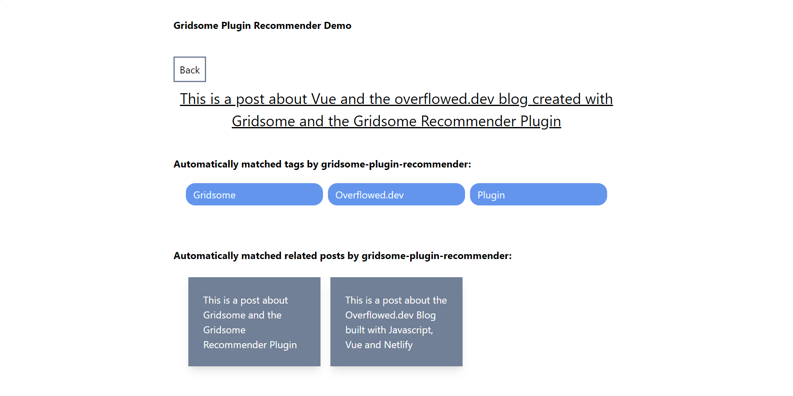

#  Gridsome Recommender Plugin

[](https://www.npmjs.com/package/gridsome-plugin-recommender)

Use machine learning to create relations in your content.

Improve user´s average time on page of your [Gridsome](https://gridsome.org/) site by generating recommendations with related content users might be interested in, such as similar posts or related products.


## 
Analyses your posts / products or whatever entity you have and creates relations between similar data nodes based on text analysis. For more information on the text analysis part visit [content-based-recommender](https://github.com/stanleyfok/content-based-recommender)
 
## Common Use Cases

1. Find related posts and recommend similar posts to users
2. Show related products the user might also be interested in in your shop
3. Save time by automatically tagging / categorizing your posts with related tags
4. Showing context-based ads / affiliate links on your post pages that relate to the content
5. Automatically generating tag / category indexes for your posts or products 
 
## Examples

### See Post-Recommendations and Contextual-Ads in action [on my site](https://www.overflowed.dev)
### See Post-Recommendations and Auto-Tagging in action [on the demo site](https://mklueh.github.io/gridsome-plugin-recommender/) with [source code](https://github.com/mklueh/gridsome-plugin-recommender/tree/master/example)




## Restrictions

**This plugin does not operate on the GraphQL Layer. Any content source that plugs in via GraphQL should not work with it. 
It only works with source plugins that operate on the [Gridsome Data Store API](https://gridsome.org/docs/data-store-api/).
Tested with [gridsome-source-filesystem](https://gridsome.org/plugins/@gridsome/source-filesystem)**


## Install

- `yarn add gridsome-plugin-recommender`
- `npm install gridsome-plugin-recommender --save`

## Getting Started

Example: Find similar blog posts based on the title. You can find a more complex example on GitHub under /example

```js
module.exports = {
  plugins: [
    {
      use: '@gridsome/source-filesystem',
      options: {
        path: 'content/posts/**/*.md',
        typeName: 'Post',
      },
    },
    {
      use: "gridsome-plugin-recommender",
      options: {
        enabled: true,
        typeName: 'Post',
        referenceTypeName: 'Tag',
        field: 'title',
        referenceField: 'title',
        relatedFieldName: 'related',
        referenceRelatedFieldName: 'related',
        caseSensitive: false,
        minScore: 0.01,
        maxScore: 1,
        minRelations:3,
        maxRelations: 10,
        fillWithRandom:false,
        debug: false
      }
    }
  ]
};
```

**Important notice: the plugin needs to be placed below your source plugins or otherwise no required collections are created before. 
[Issue-1342](https://github.com/gridsome/gridsome/issues/1342)**


In your **templates** use something like this

```
<page-query>
    query RelatedPosts {
      allPost(filter:{id:{eq:"current-post-id"}}) {
        edges {
          node {
            id
            related{
              id
              path
            }
          }
        }
      }
    }
</page-query>
```


## Options

#### enabled

- Type: `boolean`

Enables / Disables the entire plugin. This might break your UI logic as the relations will be missing from
your nodes.

#### debug

- Type: `boolean`

Enables log messages

#### typeName

- Type: `string` _required_

The default collection we want to use to create relations of similar nodes or reference nodes.

#### referenceTypeName

- Type: `string` _required_

The reference collection we want to use to create relations of default collection nodes.

#### field

- Type: `[string]` _required_

The collection field we want to analyze for similarities

#### referenceField

- Type: `[string]` _required_

The reference collection field we want to analyze for similarities

#### relatedFieldName

- Type: `[string]`
- Default: related

The field attached to your GraphQl node of the default collection containing the related objects.
Allows creating multiple relations per collection.

#### referenceRelatedFieldName

- Type: `[string]`
- Default: related

The field attached to your GraphQl node of the reference collection containing the related objects.
Allows creating multiple relations per collection.

#### minScore

- Type: `number` [0,1]
- Default: 0.01

Minimum score required to identify a relation between two nodes.

**This might need to be adjusted depending on your content length**


#### maxScore

- Type: `number` [0,1]
- Default: 1

Maximum score allowed to identify a relation between two nodes

#### minRelations

- Type: `number`
- Default: 3

Minimum relations to be produced. If the number of similar nodes is smaller than minRelations,
it will be filled with random items when fillWithRandom is enabled

#### maxRelations

- Type: `number`
- Default: 10

Maximum relations to be produced

#### caseSensitive

- Type: `boolean`
- Default: false

Enables case-sensitive matching

#### fillWithRandom

- Type: `boolean`
- Default: false

Enables filling relations up to number of minRelations with random nodes

## Usage

This plugin will install and configure [content-based-recommender](https://github.com/stanleyfok/content-based-recommender).
Please refer to it in case of any problems related to the accuracy or performance issues that might occur when using
large collections. 

